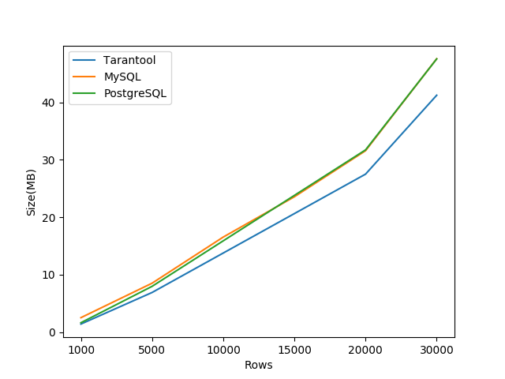

# Сравнение занимаемого места в Tarantool, MySQL, PostgreSQL

## Данные

1. Cхема: 20 полей числа/строки. Tarantool - integer primary key.
MySQL/PostgreSQL - BIGINT, VARCHAR (папка `schema`)

## Проверить занимаемое место

Результаты измерения - `graph.csv`

### 1. MySQL: 
Cборка докера
```bash
$ docker pull mysql
$ docker run  --rm --name test-mysql -e MYSQL_ROOT_PASSWORD=admin \
        -v `pwd`/schema/mysql.sql:/mysql.sql \
        -v `pwd`/data.csv:/data.csv \
        -d mysql --secure-file-priv='/' 
$ docker exec -it test-mysql bash
```

Загрузка данных
```bash
$ mysql -u root -p
```
```sql
source mysql.sql
```


### 2. Postgres: 

Cборка докера
```bash
$ docker pull postgres
$ docker run --rm -d --name test-postgres -e POSTGRES_PASSWORD=admin \
        -v `pwd`/schema/postgres.sql:/postgres.sql \
        -v `pwd`/data.csv:/data.csv \
        postgres
$ docker exec -it test-postgres bash
```

Загрузка данных
```bash
$ psql -U postgres
```

```sql
\i postgres.sql
```

### 3. Tarantool:  (Tarantool 2.4.2)

Сборка докера
```
$ docker pull tarantool/tarantool
$ docker run --name test-tarantool --rm -it\
        -v `pwd`/schema/tarantool.lua:/opt/tarantool/tarantool.lua \
        -v `pwd`/data.csv:/data.csv \
         tarantool/tarantool tarantool /opt/tarantool/tarantool.lua
```

# График зависимости от размера таблицы



## Jsonb

## Коэфициент сжатия zstd

| rows | snap | memtx | zstd | 
| ---- | ---- | ----- | ---- | 
| 1000 | 1014127 | 2747184 | 0.36 |  
| 5000 | 5031202 | 8668720 |  0.58 |  
| 10000| 10052507 | 16070640 | 0.63 |  
| 15000| 15070328 | 23472560 | 0.64 |  
| 20000| 20089580 | 30874480 | 0.65 |  
| 30000| 30128417 | 45678320 | 0.66 |                 