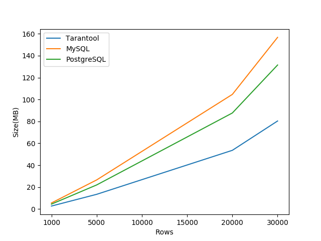

# Сравнение занимаемого места в Tarantool(2.4.2), MySQL(8.0.21), PostgreSQL(12.3)

## Данные

1. Cхема: 20 полей числа/строки. Tarantool - integer primary key.
MySQL/PostgreSQL - BIGINT, VARCHAR (папка `schema`)

## Проверка занимаемого места

Результаты измерения - `graph.csv`

### График зависимости от размера таблицы


Для измерения занимаемого места использовались следующие скрипты(подробнее в папке `schema`):

**MySQL**
```sql
ANALYZE TABLE tester;

SELECT 
    table_name AS `Table`, 
    data_length as `Table bytes`,
    index_length as `Index bytes`,
    data_length + index_length as `Total bytes`,
    round(((data_length + index_length) / 1024 / 1024), 2) `Size in MB` 
FROM information_schema.TABLES 
WHERE table_schema = "testdb"
    AND table_name = "tester";
```

**PostgreSQL**
```sql
SELECT *, pg_size_pretty(total_bytes) AS total
    , pg_size_pretty(index_bytes) AS index
    , pg_size_pretty(toast_bytes) AS toast
    , pg_size_pretty(table_bytes) AS table
  FROM (
  SELECT *, total_bytes-index_bytes-coalesce(toast_bytes,0) AS table_bytes FROM (
      SELECT c.oid,nspname AS table_schema, relname AS table_name
              , c.reltuples AS row_estimate
              , pg_total_relation_size(c.oid) AS total_bytes
              , pg_indexes_size(c.oid) AS index_bytes
              , pg_total_relation_size(reltoastrelid) AS toast_bytes
          FROM pg_class c
          LEFT JOIN pg_namespace n ON n.oid = c.relnamespace
          WHERE relkind = 'r' AND relname = 'tester'
  ) a
) a;
```

**Tarantool**
```lua
function size_info()
    local space = tonumber(box.space.tester:bsize()) 
    local index = tonumber(box.space.tester.index.primary:bsize()) 
    return {
        space = space,
        index = index,
        total = space + index,
    }
end
```

## Json-данные

Результаты измерений - `graph-json.csv`



Использовались те же докер контейнеры, но для инициализации хранилищ скрипты с суффиксом `-json`.

Использовались следующие типы данных:
* MySQL - json
* PostgreSQL - jsonb
* Tarantool - table

## Коэфициент сжатия zstd

| rows | snap | memtx | zstd | 
| ---- | ---- | ----- | ---- | 
| 1000 | 1014127 | 2747184 | 0.36 |  
| 5000 | 5031202 | 8668720 |  0.58 |  
| 10000| 10052507 | 16070640 | 0.63 |  
| 15000| 15070328 | 23472560 | 0.64 |  
| 20000| 20089580 | 30874480 | 0.65 |  
| 30000| 30128417 | 45678320 | 0.66 |                 

## Запуск докер-контейнеров

### 1. MySQL: 
Cборка докера
```bash
$ docker pull mysql
$ docker run  --rm --name test-mysql -e MYSQL_ROOT_PASSWORD=admin \
        -v `pwd`/schema/mysql.sql:/mysql.sql \
        -v `pwd`/data.csv:/data.csv \
        -d mysql --secure-file-priv='/' 
$ docker exec -it test-mysql bash
```

Загрузка данных
```bash
$ mysql -u root -p
```
```sql
source mysql.sql
```


### 2. Postgres: 

Cборка докера
```bash
$ docker pull postgres
$ docker run --rm -d --name test-postgres -e POSTGRES_PASSWORD=admin \
        -v `pwd`/schema/postgres.sql:/postgres.sql \
        -v `pwd`/data.csv:/data.csv \
        postgres
$ docker exec -it test-postgres bash
```

Загрузка данных
```bash
$ psql -U postgres
```

```sql
\i postgres.sql
```

### 3. Tarantool:

Сборка докера
```
$ docker pull tarantool/tarantool
$ docker run --name test-tarantool --rm -it\
        -v `pwd`/schema/tarantool.lua:/opt/tarantool/tarantool.lua \
        -v `pwd`/data.csv:/data.csv \
         tarantool/tarantool tarantool /opt/tarantool/tarantool.lua
```
